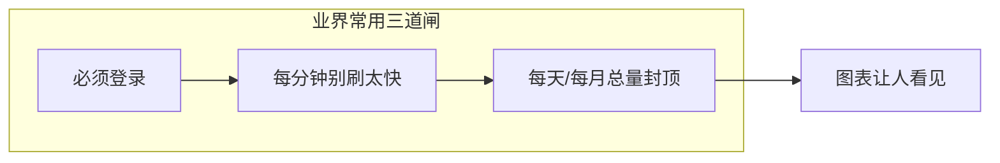
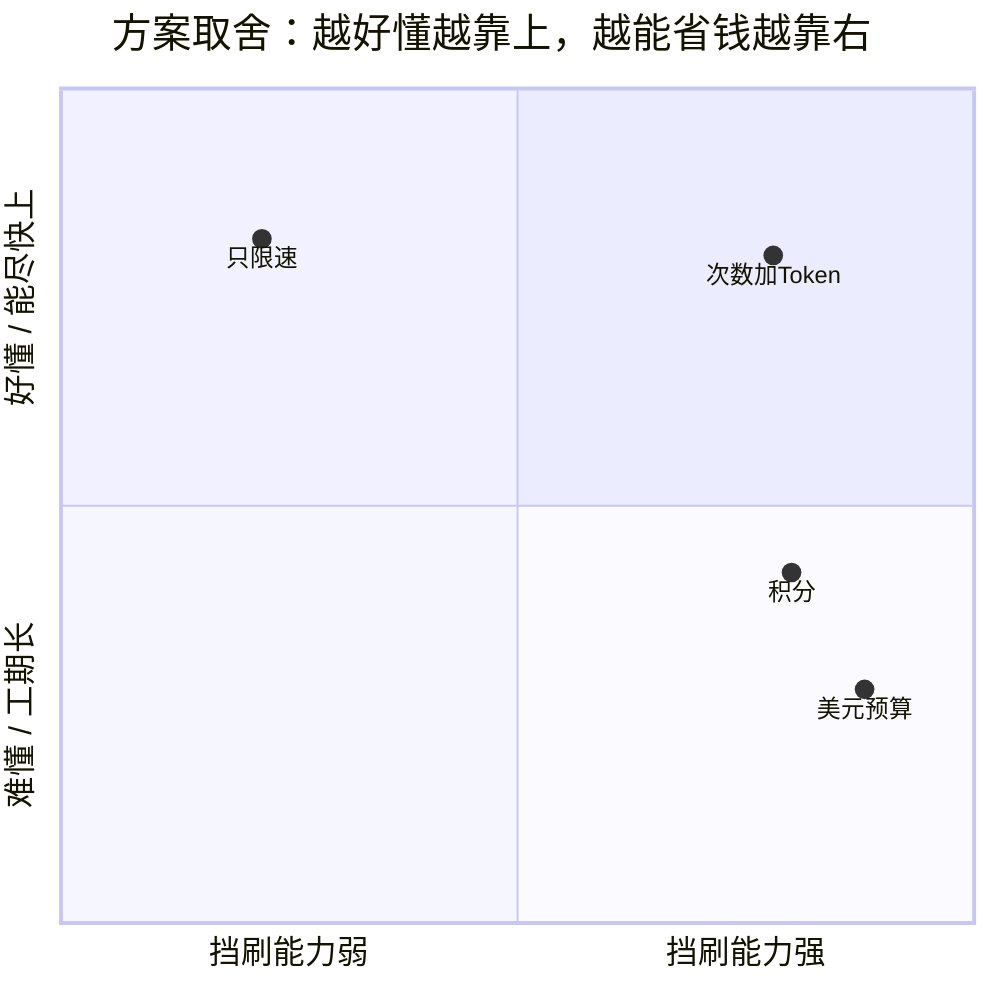
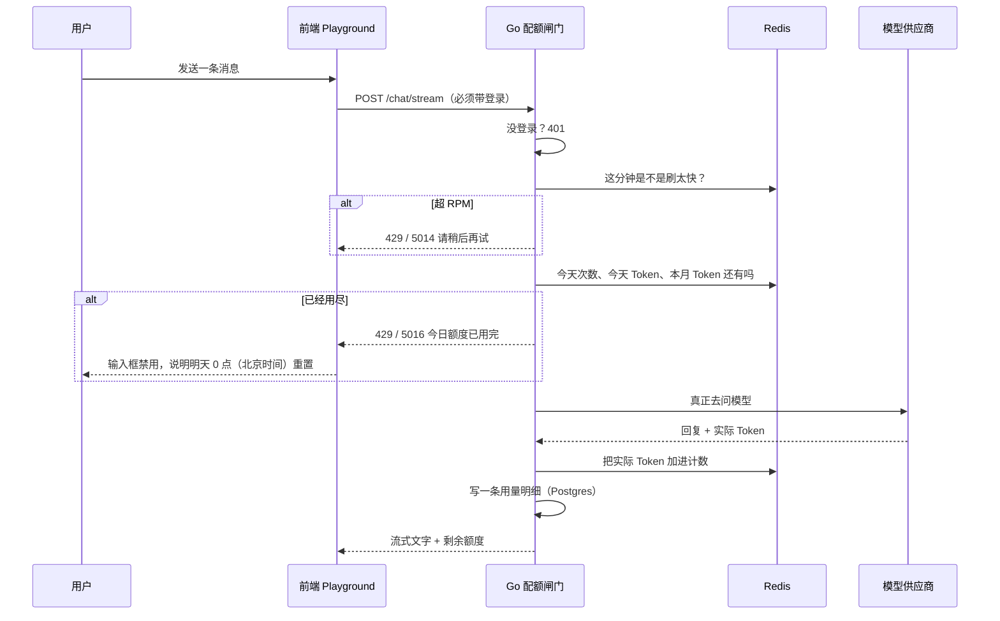
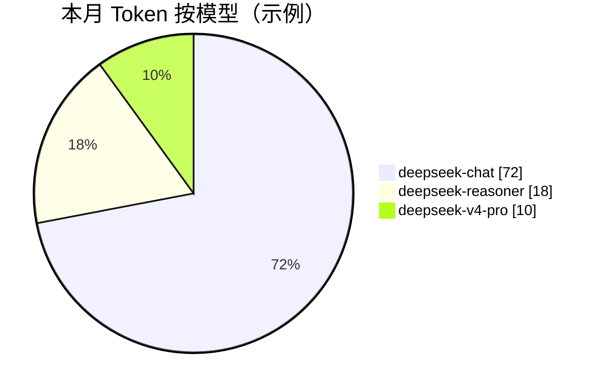

# CogniForge 配额与用量设计

## [变更记录]

| 日期 | 版本 | 变更摘要 | 负责人 |
|------|------|---------|--------|
| 2026-08-18 | v1.0 | 立项：Playground 用量配额 + 统计看板；对比业界方案并选定 MVP | orjrs |

## [变更] 配额功能立项（2026-08-18）

- **变更原因**：Playground 目前可以无限对话。对话走平台在「模型」页配好的共用 API Key，别人多用一次，平台账单就多一笔。
- **包含代码**：本文为设计稿，**尚未写代码**。落地后对应 Go `internal/quota`、聊天鉴权、Web 用量页。
- **影响范围**：需求 / 架构 / 库表 / API / 前端 / 开发计划（见文末「文档同步」）。
- **变更前 vs 变更后**：~~谁登录都能一直聊，聊天接口甚至可以不登录~~（2026-08-18）→ 必须登录；每人每天/每月有额度；用完提示明天再来；管理员能看统计图。

---

## 0. 一句话说明（给非技术同学）

把 Playground 想象成公司的打印机：纸和墨水是老板买的。  
现在任何人都可以无限打印。配额就是：**每人每天只能打一定张数，快用完会提醒，用完就停**。  
同时给一张「用量报表」，让管理员看见谁用得多、哪天用得多、哪个模型贵。

**第一期不做收费、不做充值。** 只做「限量 + 看得见」。

---

## 1. 为什么现在必须做

### 1.1 现状（代码里已经是这样）

| 事实 | 说明 |
|------|------|
| 模型 Key 是共用的 | 「模型」页填的 DeepSeek / OpenAI Key，所有人对话都走这一把钥匙 |
| Playground 会打上游 | `POST /api/v1/chat/stream` 每次都会向供应商计费 |
| 聊天接口目前**可以不登录** | 路由是公开的，浏览器或脚本都能刷 |
| 监控页只记 HTTP 次数 | `request_logs` 没有 Token、没有费用、没有按用户配额 |
| 计费 Java 服务是空目录 | 不能等那个服务，配额必须做在现有 Go 后端里 |

### 1.2 要挡住的三件事

1. **白嫖**：注册一个号（或干脆不登录）一直聊，把平台 Key 刷光。
2. **误用**：某个人把对话历史越堆越长，一条消息烧掉几万 Token。
3. **看不见**：管理员不知道今天烧了多少、谁在烧、哪个模型贵。

### 1.3 本期范围

| 做 | 不做（以后再说） |
|----|----------------|
| 必须登录才能对话 | 按人民币充值 / 发票 |
| 每人每天次数 + Token 上限 | 独立 Java 计费中心 |
| 每分钟次数上限（防脚本） | 按组织/项目多层配额（现在还没有真正的多租户组织表落地） |
| 用完硬拦截 + 80% 黄灯 | 自动向供应商买额度 |
| 用户自己看剩余；管理员看全站图表 | 把知识库内部 embedding 算进用户额度 |

---

## 2. 别人家怎么做（可抄交互，不抄商业模式）

下面几家产品解决的是同一类问题：「模型很贵，试用入口不能无限开」。

### 2.1 OpenAI Platform（开发者控制台）

- **限速**：每分钟请求数 RPM、每分钟 Token 数 TPM。防突发，**挡不住一天慢慢刷**。
- **用量限额**：按美元设月度预算，到 80%/100% 发邮件，可设硬顶。
- **看板**：按天柱状图看 Token / 费用，可按模型拆开。

对我们有用的：**硬顶 + 图表 + 快用完提醒**。  
对我们太重的：要先有准确单价表和账单系统。

### 2.2 Cursor（编辑器里的 AI）

- 按「请求次数」而不是美元。用户听得懂：「这个月还剩 200 次 Fast」。
- 单独 Usage 页：剩余、已用、按模型拆分。
- 用完不是悄悄变差，而是明确告诉你额度没了。

对我们有用的：**次数比美元好懂**；Playground 角落显示剩余。

### 2.3 ChatGPT / Claude 网页版

- 高级模型有「一段时间只能发 N 条」。
- 用户感知是「聊累了让你歇一歇」，不是会计账本。

对我们有用的：**对话页直接挡住发送**，文案要人话。

### 2.4 Dify / 扣子 Coze

- Dify：工作空间有 Token 配额，成员共用或再拆。
- 扣子：积分。贵模型扣得多，便宜模型扣得少。

对我们有用的：**贵模型多扣**（二期积分）。  
对我们太早的：积分规则、兑换、运营活动。

### 2.5 Groq / 各种免费 Playground

- 必须登录。
- 每天固定条数，用完明天重置。
- 生产 API Key 和 Playground 额度分开。

对我们有用的：**登录是配额的前提**；日历日重置，好解释。



**结论**：第一期同时做这三道闸 + 一张用量图。不要一上来做充值。

---

## 3. 四个方案（怎么选）

### 3.1 方案一：次数 + Token 双限额（推荐，第一期就做这个）

**一句话**：每人每天最多发 N 条消息，并且每天/每月 Token 不能超过上限。再加每分钟条数，防止脚本狂点。

| 维度 | 默认值（管理员可改） | 人话 |
|------|----------------------|------|
| 每天对话次数 | 30 条 | 认真聊大约半小时 |
| 每天 Token | 10 万 | 普通闲聊够用；超长上下文会提前用完 |
| 每月 Token | 100 万 | 试用级，当不成免费 GPT |
| 每分钟次数 RPM | 8 | 防脚本，正常人点不过去 |
| 80% 预警 | 亮黄 | 「今天额度快用完了」 |
| 100% | 硬停 | 发送按钮不可用，提示明天 0 点重置 |

**优点**

- 用户听得懂（还剩几条）。
- Token 上限能挡住「一条消息塞整本书」。
- 和现有 Redis、Go 中间件、监控页都能接上。
- 不依赖 Java 计费空目录。

**缺点**

- 不同模型一样贵（V4 和 chat 扣同样「1 条」）。二期用积分补。

**适合**：现在这个阶段。目标就是别让 Playground 被刷爆。

### 3.2 方案二：积分 / 点数（扣子风格，建议二期）

每条对话按「模型单价 × Token」扣积分。例如 `deepseek-chat = 1 分/千 Token`，`deepseek-v4-pro = 8 分/千 Token`。

**优点**：贵模型自然少用，公平。  
**缺点**：要维护价目表、解释积分、做充值入口。第一期会拖很久。

### 3.3 方案三：只做每分钟限流（RPM）

像 Nginx 限流：每用户每分钟最多 8 次。

**优点**：半天能做完。  
**缺点**：慢慢聊一天照样把 Key 刷光。**单独采用等于没解决老板的问题。**

> 方案三不单独上，但会作为方案一里的「防刷」配套。

### 3.4 方案四：按美元预算硬顶（OpenAI Usage Limits）

管理员设「本月最多花 $20」，系统按模型官方价估算。

**优点**：和账单语言一致。  
**缺点**：要维护各家价格、汇率、折扣；现在 `request_logs` 连 Token 都没记；Java 计费服务还是空的。过重。

### 3.5 对比（怎么选一眼能看完）

| | 方案一 次数+Token ★ | 方案二 积分 | 方案三 只限速 | 方案四 美元预算 |
|--|---------------------|-------------|--------------|-----------------|
| 挡住无限刷 | 强 | 强 | 弱 | 强 |
| 用户好不好懂 | 好懂 | 要学积分 | 几乎无感 | 要懂美元 |
| 第一期工期 | 约 1～1.5 周 | 2～3 周 | 1～2 天 | 3 周+ |
| 要不要价目表 | 否 | 要 | 否 | 要 |
| 统计图好不好做 | 好做 | 好做 | 几乎没有「额度」可画 | 要先有费用 |
| 和现有代码匹配 | Redis + Go | 要新账本 | 中间件即可 | 要计费中心 |
| **结论** | **采用** | 二期 | 作为配套 | 以后商业化再做 |



**拍板：第一期做方案一；限速（方案三）一起做；积分和美元预算写进后续，不挡上线。**

---

## 4. 推荐方案怎么工作

### 4.1 谁消耗额度

| 入口 | 算不算用户额度 | 原因 |
|------|----------------|------|
| Playground 对话 `/chat/stream` | **算** | 这就是要挡的入口 |
| 非流式 `/chat/completions` | **算** | 同一把钥匙，避免绕开页面刷 |
| 智能体对话 `/agents/:id/chat` | **算** | 背后还是同一套 Chat |
| 知识库内部 embedding | **不算用户额度** | Python RAG 回调，没有终端用户；另计系统用量，避免检索把对话额度吃光 |
| 工作流 LLM 节点 | 第一期可先算，与对话共用 | 防止用工作流绕过 Playground |

未登录请求：**直接 401，不打上游**。这是配额能成立的前提。

管理员（`role=admin`）：默认**不受额度限制**，但仍记用量，方便看图。可在策略里改成「管理员也限」。

### 4.2 检查顺序（每次点发送）



**先检查再调用。** 额度没了绝不再去打 DeepSeek，避免「提示用完了但钱已经花了」。

并发两条刚好卡在上限附近时，允许轻微超出（简化实现）。用 Redis `INCR` 原子加，不在 Postgres 里抢锁。

### 4.3 用完了用户看到什么

不要弹一堆英文错误码。Playground 行为：

1. **还剩 ≥ 20%**：正常聊。角落有一小节「今日 12/30 条 · Token 32%」。
2. **还剩 < 20%**：黄灯文案「今天额度快用完了」。
3. **用尽**：发送按钮灰掉。Toast：「今日对话额度已用完，将在明天 0 点（北京时间）恢复。」管理员可在后台给这个人临时加额。
4. **刷太快**：Toast：「发送太频繁，请等几秒。」不消耗每日次数（请求被拒在闸门）。

业务码约定（和现有 `internal/response` 对齐）：

| HTTP | 业务码 | 含义 | 现有/新增 |
|------|--------|------|-----------|
| 401 | 5005 | 未登录 | 现有 `CodeUnauthorized` |
| 429 | 5014 | 每分钟太快 | 现有 `CodeRateLimitExceeded` |
| 429 | 5016 | 平台用户额度用尽 | **新增** `CodeUserQuotaExceeded` |
| 502/503 | 4008 | 上游供应商自己没额度了 | 现有 `CodeAIQuotaExhausted`（DeepSeek/OpenAI 账单，不是我们的限额） |

两套「配额用尽」必须分开：否则用户会以为是 CogniForge 限额，其实是老板的 Key 在供应商那边欠费。

### 4.4 重置规则

| 限额 | 重置 | 时区 |
|------|------|------|
| 每天次数 / 每天 Token | 每天 00:00 | **Asia/Shanghai**（写死，避免服务器在 UTC 让用户觉得「怎么下午才刷新」） |
| 每月 Token | 每月 1 日 00:00 | 同上 |
| RPM | 自然分钟滚动 | — |

Redis Key 带日期（`20260818`），第二天自然变成新 Key，旧 Key 设 48 小时过期即可。

---

## 5. 页面与统计图（用户能看见什么）

### 5.1 信息放哪

| 页面 | 谁看 | 干什么 |
|------|------|--------|
| Playground 输入框上方 | 所有登录用户 | 剩余条数 / Token 进度，用完禁用发送 |
| Dashboard 首页一张卡 | 所有登录用户 | 「今日剩余 18 条」，点进去用量页 |
| **用量 Usage** `/usage`（新页面） | 所有登录用户 | 自己的图：近 7/30 天柱状图、模型饼图 |
| **配额策略** `/admin/quota`（新页面） | 仅 admin | 改默认上限、给某用户加塞、看全站排行 |
| 监控 Monitor `/monitor` | 仅 admin | **继续做 HTTP 日志**，不和用量抢职责 |

导航：在 Keys 和 Monitor 之间加 **Usage**（所有人可见）。Admin 的配额策略放用户下拉或 Usage 页里的「管理」Tab。

> 现网导航曾经冻结「不改 IA」。配额是新产品能力，允许加一个模块，**不删旧模块**。

### 5.2 Playground 额度条（示意）

```
┌──────────────────────────────────────────────────────────┐
│  今日额度  ████████████░░░░  18 / 30 条 · Token 32%      │
│  本月 Token  ██░░░░░░░░░░░░  12%                          │
└──────────────────────────────────────────────────────────┘
          （对话区不变，额度条做轻量，不要变成财务软件）
```

颜色：正常用电青；≥80% 用主题警告色；用尽用危险色。沿用现有四套主题 Token，不新做皮肤。

### 5.3 用户用量页：四张图

管理员和普通用户看到的图一样，差别只是「数据范围」：普通用户只有自己，管理员可切「全站 / 某人」。

#### 图 A · 今日概览（四张数字卡，仿 Dashboard）

| 卡 | 图标建议（Lucide） | 示例 |
|----|-------------------|------|
| 今日已用次数 | `i-lucide-message-square` | 12 / 30 |
| 今日 Token | `i-lucide-coins` | 3.2 万 / 10 万 |
| 本月 Token | `i-lucide-calendar` | 12 万 / 100 万 |
| 近 7 天费用估算 | `i-lucide-wallet` | ≈ ¥4.2（仅估算，可关） |

费用估算第一期可以先按「粗单价」显示，并标注「非正式账单」。不想吓人可以只显示 Token，把费用做成开关。

#### 图 B · 近 7 天 Token 柱状图（主图）

```mermaid
xychart-beta
    title 近 7 天 Token 用量（示例数据）
    x-axis ["8/12", "8/13", "8/14", "8/15", "8/16", "8/17", "8/18"]
    y-axis "Token（千）" 0 --> 80
    bar [12, 28, 9, 41, 35, 6, 22]
```

交互：切换 7 天 / 30 天；切换「次数」或「Token」。鼠标悬停显示当天数字。

#### 图 C · 模型占比（饼图）



用途：发现有人把默认模型改成贵的 V4，管理员可以提醒或单独降额。

#### 图 D · 管理员才有：用户排行

横向条：本周 Token Top 10。点名字可给该用户加额或禁用对话。

```mermaid
xychart-beta
    title 本周 Token Top 用户（示例，单位：千）
    x-axis ["用户A", "用户B", "用户C", "用户D", "用户E"]
    y-axis "Token（千）" 0 --> 200
    bar [180, 95, 60, 28, 12]
```

#### 图 E · 用量 vs 限额（进度环，放在页头）

两个环并排：

- 今日次数 12/30 = 40%
- 今日 Token 32%

用 Nuxt UI 已有的进度条 / 环形即可，不必上 ECharts 全家桶。柱状图、饼图建议 **ECharts 或 unovis 二选一，全站只留一种**（监控页以后若加图也用同一套）。

### 5.4 Dashboard 改动

现有四张统计卡（Agent / 工作流 / …）旁或下方加一张：

- 标题：今日对话额度
- 数字：`18` 剩余
- 说明：共 30 条
- 点击 → `/usage`

不替换原有卡。

---

## 6. 数据怎么存（落地时必须按这个名字）

现网表**没有** `cf_` 前缀（`users`、`request_logs`、`chat_conversations`）。配额表同样不加重前缀。

### 6.1 `quota_policies` 策略

一行 = 一条规则。`user_id` 为空表示「全站默认」；有 `user_id` 表示覆盖某人。

| 字段 | 类型 | 说明 |
|------|------|------|
| id | varchar(64) PK | |
| user_id | varchar(64) 可空 | 空 = 默认策略 |
| daily_requests | int | 每天条数，0 表示不限制该维 |
| daily_tokens | bigint | 每天 Token |
| monthly_tokens | bigint | 每月 Token |
| rpm | int | 每分钟请求 |
| admin_unlimited | bool | 管理员是否不限额，默认 true |
| enabled | bool | |
| created_at / updated_at | timestamptz | |

同时只允许 **一条** `user_id IS NULL` 的默认策略。

### 6.2 `llm_usage_events` 明细（图表的原料）

每次成功（或明确失败）打模型后写一行。不要把 Token 塞进现在的 `request_logs` 里凑合：那张表是 HTTP 访问日志，和「模型用量」不是一回事。

| 字段 | 说明 |
|------|------|
| id | PK |
| user_id | 可空（系统 embedding 为空） |
| source | `playground` / `agent` / `workflow` / `embed` |
| model | 如 `deepseek-chat` |
| prompt_tokens / completion_tokens / total_tokens | 上游返回；没有则估算后标记 `tokens_estimated=true` |
| status | `ok` / `error` / `quota_blocked` |
| latency_ms | |
| trace_id | 和现有链路对齐 |
| created_at | 索引 `(user_id, created_at)`、`(created_at)`、`(model, created_at)` |

`quota_blocked` 也要记：管理员能看见「有多少人撞到天花板」，这本身就是产品信号。

### 6.3 Redis 键（强制 `cogniforge:` 前缀，db0）

先写进库表文档 §5.1，再写代码。热路径只认 Redis，Postgres 明细异步写（失败只记日志，不让对话失败）。

```
cogniforge:quota:policy:rev                         # 策略变更 INCR，进程内缓存失效
cogniforge:quota:user:{userId}:day:{yyyyMMdd}:req     # 当天次数
cogniforge:quota:user:{userId}:day:{yyyyMMdd}:tokens  # 当天 Token
cogniforge:quota:user:{userId}:month:{yyyyMM}:tokens  # 当月 Token
cogniforge:quota:rl:{userId}:{yyyyMMddHHmm}           # 当前分钟次数
```

TTL：日键 48 小时，月键 40 天，分钟键 2 分钟。  
禁止把 API Key 写进这些键。

### 6.4 默认策略种子

系统启动若没有默认行，插入：

```
daily_requests = 30
daily_tokens   = 100000
monthly_tokens = 1000000
rpm            = 8
admin_unlimited = true
```

数字全部可在 `/admin/quota` 改，不必发版。

---

## 7. 接口草案（认证均为 JWT）

统一响应仍是 `{ code, message, trace_id, data }`。

### 7.1 当前用户额度（Playground / Dashboard 都会打）

```
GET /api/v1/quota/me
```

```json
{
  "code": 2000,
  "data": {
    "unlimited": false,
    "day": {
      "requests_used": 12,
      "requests_limit": 30,
      "tokens_used": 32000,
      "tokens_limit": 100000,
      "resets_at": "2026-08-19T00:00:00+08:00"
    },
    "month": {
      "tokens_used": 120000,
      "tokens_limit": 1000000,
      "resets_at": "2026-09-01T00:00:00+08:00"
    },
    "warn": false
  }
}
```

`warn=true` 表示任一维度 ≥ 80%。前端用这个决定黄灯，不要自己算错。

### 7.2 用量序列（图表）

```
GET /api/v1/quota/usage?range=7d&metric=tokens
```

`range`: `7d` | `30d`  
`metric`: `requests` | `tokens`  
普通用户只能看自己；admin 可加 `user_id=` 或 `scope=all`。

返回按天数组 + `by_model` 饼图数据 +（admin）`top_users`。

### 7.3 管理员改策略

```
GET  /api/v1/admin/quota/policy
PUT  /api/v1/admin/quota/policy          # 改全站默认
PUT  /api/v1/admin/quota/users/:id       # 覆盖某用户；传 null 表示取消覆盖
```

仅 `role=admin`。

### 7.4 聊天接口变更（行为，路径不变）

| 接口 | 变更前 | 变更后 |
|------|--------|--------|
| `POST /api/v1/chat/stream` | 公开，可匿名刷 | **必须登录** + 配额闸门 |
| `POST /api/v1/chat/completions` | 公开 | **必须登录** + 配额闸门（Python 内部回调需改用服务间约定，见下） |
| `POST /api/v1/agents/:id/chat` | 已登录 | 加配额闸门 |
| `POST /api/v1/embeddings` | 内网公开 | 仍不走用户配额；可加内网 Token 或只允许来自 Python 的调用 |

**兼容点**：cogniforge-ai 现在会回调 Go 的 chat。不能一刀切「全部要用户 JWT」。落地时：

- 浏览器来的 Playground → 用户 JWT + 用户配额。
- Python 回调 → 继续用内网信任（已有 `COGNIFORGE_API_URL`），**不算用户 Playground 额度**，但写入 `source=embed|agent` 明细供管理员看系统用量。

若 Python Agent 对话其实是用户点的，应让 Go 的 `/agents/:id/chat` 走用户配额（现网已是这条），不要让浏览器直打 Python。

---

## 8. 前端组件（对齐现有 UI 规范）

沿用 `docs/05-frontend/03-ui-redesign-shadcn.md`：Nuxt UI 为主，页面壳 `cf-page`。

| 能力 | 组件 |
|------|------|
| 额度数字卡 | 复用 Dashboard `stat-card` |
| 进度条 | `UProgress` |
| 近 7 天柱状 / 饼图 | 全站选定 **一种** 图表库，建议 ECharts（阶段八文档已提过） |
| 排行表 | `UTable` |
| 用尽 Toast | 已有 Nuxt UI Toast，文案走 i18n |
| Playground 禁用发送 | 现有 `UChatPromptSubmit` `:disabled` |

新文件（落地时）：

- `cogniforge-web/pages/usage.vue`
- `cogniforge-web/pages/admin/quota.vue`（或 Usage 页 admin Tab）
- `cogniforge-web/composables/useQuota.ts`
- `cogniforge-web/components/QuotaBar.vue`（Playground 顶栏轻量条）

---

## 9. 后端落点（Go，不新建 Java 服务）

```
internal/quota/
  policy.go      # 读策略，进程内缓存 + Redis rev
  counter.go     # Redis INCR / 读取剩余
  middleware.go  # 聊天热路径闸门
  recorder.go    # 写 llm_usage_events
  handler.go     # /quota/me /quota/usage /admin/quota
  service.go
```

聊天 Handler 在调用供应商**之前**走闸门；流式结束拿到 usage 后 `INCR` Token。  
若上游流式不返回 usage（有的供应商最后一帧才给），用 `max_tokens` 做预扣、结束后按实际多退少补；第一期也可以：无 usage 时按「提示词字数/4 + 生成字数/4」估算并打标。

~~把配额做进 Java `services/billing/`~~（2026-08-18，不采用：目录是空的，热路径也不该跨语言）。

---

## 10. 分期

| 期 | 内容 | 大约工期 | 验收（给非技术同学） |
|----|------|----------|----------------------|
| **12.1** | 聊天必须登录；RPM 限流 | 1 天 | 退出登录后再点发送，聊不了 |
| **12.2** | Redis 日/月限额；用完 5016 | 2 天 | 把上限临时改成 3 条，第 4 条被挡，明天能再聊 |
| **12.3** | 记下每条 Token；`GET /quota/me` | 2 天 | Playground 能看到「还剩几条」 |
| **12.4** | `/usage` 图表 + Dashboard 卡 | 2 天 | 聊几天后柱状图有高低，不是一条平线 |
| **12.5** | Admin 改默认限额、给某人加额、Top 用户 | 2 天 | 管理员把某人改成 5 条，那人立刻变少 |
| **二期** | 积分、美元预算、按组织配额 | — | 不在本期 |

测试要点：

- 未登录 `/chat/stream` → 401，**上游零调用**（可用测试里 mock 计数断言）。
- 超 RPM → 5014，不增加每日次数。
- 超每日次数 → 5016，upstream 不被调用。
- admin 默认不拦截。
- 策略更新后 `INCR cogniforge:quota:policy:rev`，多实例几秒内对齐。

---

## 11. 风险与故意不做的事

| 风险 | 处理 |
|------|------|
| 用户抱怨 30 条太少 | 限额是数据不是代码；管理员改数字即可 |
| 长对话一条烧光当天 Token | 这是特性：鼓励新开对话，少把全书塞进上下文 |
| Redis 挂了 | 失败策略：**拒绝对话**（fail closed）。配额的意义就是省钱，不能 Redis 一挂就无限放行 |
| 流式中途断了 | 已产生的 completion 仍计 Token（钱已经花了） |
| 有人用 API Key 调 `/chat/stream` | 第一期 API Key 与 JWT 一样计入该用户；若还没有「Key 所属用户」，先只认 JWT |

**故意不做**

- 不按 IP 给未登录用户发「每天 3 条试用」（容易被代理绕过，且现在目标是挡刷，不是增长）。
- 不把 embedding 算进个人额度。
- 不做邮件告警（可二期，80% 先做页面黄灯）。
- 不在 README 里写真实域名 / Key。

---

## 12. 文档同步（本次设计涉及）

| 文档 | 改什么 |
|------|--------|
| 本文 | 主设计 |
| `docs/01-requirements/01-product-requirements.md` | 增加配额需求条目 |
| `docs/02-architecture/01-technical-architecture.md` | Go 配额闸门，不走 Java 计费空服务 |
| `docs/03-api/01-api-design.md` | `/quota/*`、聊天必须登录、5016 |
| `docs/04-database/01-database-design.md` | 两张表 + Redis 键 |
| `docs/05-frontend/03-ui-redesign-shadcn.md` | Usage 页、Playground 额度条、导航 |
| `docs/99-dev-plan/01-development-plan.md` | 阶段十二 |

---

## 13. 给决策人的选择题（如果要改拍板）

默认已经按 **方案一** 写进各文档。若你想换：

1. **就按方案一做**（推荐）——下一步才写代码。
2. **只要每天 N 条，先不要 Token 上限**——更快，但挡不住超长上下文。
3. **直接上积分**——要先定每个模型多少分，第一期会更久。
4. **管理员完全不限、普通用户更严**——方案一已包含，只需改默认数字。

默认数字（30 条 / 10 万 Token / 天）可以上线前再调；**结构不要推翻**。
